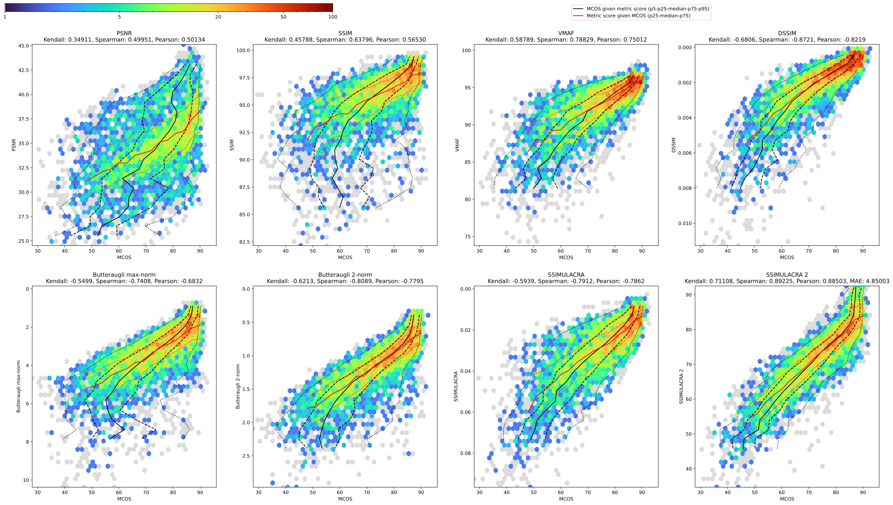
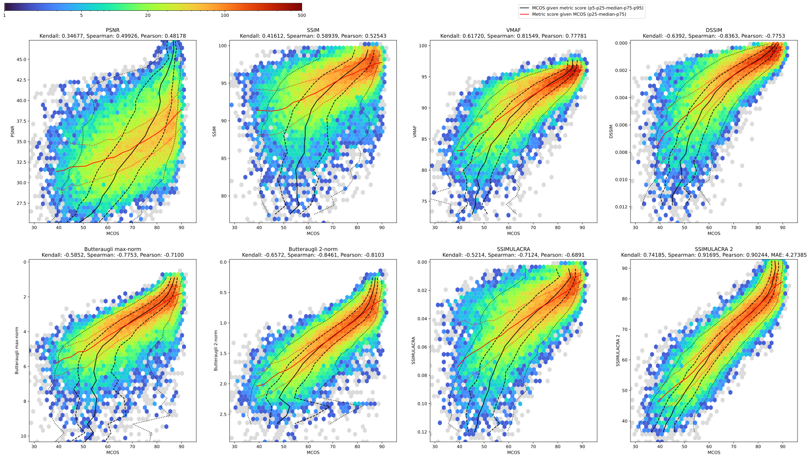

# SSIMULACRA 2 - Structural SIMilarity Unveiling Local And Compression Related Artifacts

Perceptual metric developed by Jon Sneyers (Cloudinary) in July-October 2022.

## Usage
```
ssimulacra2 original.png distorted.png
```

Returns a score in range -inf..100, which correlates to subjective visual quality scores as follows:

- 30 = low quality. This corresponds to the p10 worst output of mozjpeg -quality 30.
- 50 = medium quality. This corresponds to the average output of cjxl -q 40 or mozjpeg -quality 40, or the p10 output of cjxl -q 50 or mozjpeg -quality 60.
- 70 = high quality. This corresponds to the average output of cjxl -q 65 or mozjpeg -quality 70, p10 output of cjxl -q 75 or mozjpeg -quality 80.
- 90 = very high quality. Likely impossible to distinguish from the original when viewed at 1:1 from a normal viewing distance. This corresponds to the average output of mozjpeg -quality 95 or the p10 output of cjxl -q 95.


## How it works

SSIMULACRA 2 is based on the concept of the multi-scale structural similarity index measure (MS-SSIM),
computed in a perceptually relevant color space, adding two other (asymmetric) error maps, and
aggregating using two different norms.

- XYB color space (X+0.5, Y, Y-B+1.0)
- Three error maps:
  - SSIM map (with a corrected SSIM formula that avoids applying gamma correction twice)
  - 'blockiness/ringing' map (error means distorted has edges where original is smooth)
  - 'smoothing/blur' map (error means distorted is smooth where original has edges)
- Each of these error maps is computed at 6 scales (1:1 to 1:32) for each component (X,Y,B)
- Downscaling is done in linear color (i.e. the perceptually correct way)
- For each of these `6*3*3=54` maps, two norms are computed: 1-norm (mean) and 4-norm
- A weighted sum of these `54*2=108` norms leads to the final score
- Weights were tuned based on a large set of subjective scores for images compressed
  with JPEG, JPEG 2000, JPEG XL, WebP, AVIF, and HEIC.

The weight tuning was done by running Nelder-Mead simplex search, optimizing to minimize MSE and to
maximize Kendall and Pearson correlation for training data consisting of 17611 subjective quality scores,
validated on separate validation data consisting of 4292 scores.


Changes compared to the [original version](https://github.com/cloudinary/ssimulacra):

- works in XYB color space instead of CIE Lab
- linear downscaling
- fixed SSIM formula
- uses 1-norm and 4-norm (instead of 1-norm and max-norm-after-downscaling)
- penalizes both smoothing and ringing artifacts (instead of only penalizing ringing but not smoothing)
- removed specific grid-like blockiness detection
- tuned using a much larger set of subjective opinions (and using absolute quality scores, not just relative comparison results)


## Metric performance

Results for just the validation set (4292 subjective scores):

Metric | Kendall correlation | Spearman | Pearson |
-- | -- | -- | --
PSNR | 0.34911 | 0.49951 | 0.50134
SSIM | 0.45788 | 0.63796 | 0.56530
VMAF | 0.58789 | 0.78829 | 0.75012
DSSIM | -0.6806 | -0.8721 | -0.8219
Butteraugli max-norm | -0.5499 | -0.7408 | -0.6832
Butteraugli 2-norm | -0.6213 | -0.8089 | -0.7795
SSIMULACRA | -0.5939 | -0.7912 | -0.7862
SSIMULACRA 2 | 0.70330 | 0.88541 | 0.87448





Results for the full dataset (almost 22k subjective scores):

Metric | Kendall correlation | Spearman | Pearson |
-- | -- | -- | --
PSNR | 0.34721 | 0.50021 | 0.48171
SSIM | 0.41971 | 0.59406 | 0.53003
VMAF | 0.61764 | 0.81639 | 0.77992
DSSIM | -0.6427 | -0.8399 | -0.7813
Butteraugli max-norm | -0.5842 | -0.7738 | -0.7073
Butteraugli 2-norm | -0.6575 | -0.8455 | -0.8088
SSIMULACRA | -0.5255 | -0.7174 | -0.6939
SSIMULACRA 2 | 0.69339 | 0.88203 | 0.86007





Computing the mean absolute error between opinion scores (on a scale of 0 to 100) and SSIMULACRA 2 results,
on the full set the MAE is 5.32 and on the validation set the MAE is 4.97.


## Building

Building instructions for Debian:
```
sudo apt install build-essential git libhwy-dev liblcms2-dev libjpeg62-turbo-dev libpng-dev cmake ninja-build
mkdir build
cd build
cmake ../src -G Ninja
ninja ssimulacra2
```

or simply execute `build_ssimulacra2`. Other distributions should be similar;
you may need to use `libjpeg-turbo8-dev` instead of `libjpeg62-turbo-dev`.
Version 2.13 of lcms2 is needed.

The source code of SSIMULACRA 2 is also part of the `tools` of [libjxl](https://github.com/libjxl/libjxl/blob/main/tools/ssimulacra2.cc).

The bash script `build_ssimulacra2_from_libjxl_repo` can be used to fetch the code and compile only what is needed for SSIMULACRA 2.


